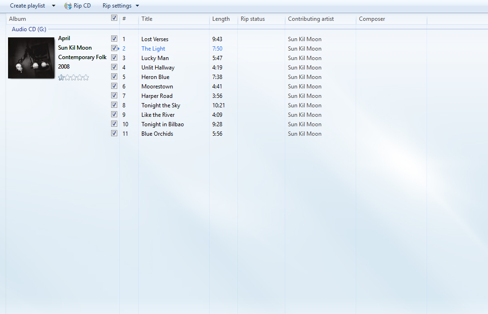

# WMP Find Album Info (FAI) Metadata Server

A local, self-hosted reimplementation of the **Find Album Information** service that
Windows Media Player 12 (and, partially, Zune) used to call when you ripped a CD or
wanted to fix the tags on a library album.

Microsoft retired the original service
(`fai.music.metadataservices.microsoft.com`). This project answers the same
requests from a local Flask server, searching **iTunes** and **MusicBrainz** for real
album metadata and cover art, and writing it back into WMP through the player's own
`IWMPCDDVDWizardExternal` COM interface.

Everything runs on your own machine. No Microsoft endpoint is contacted.

A read-only demo is deployed at **`https://wmp-fai-server.onrender.com`** (dialog
UI, search, artwork proxy, diagnostics). It is a demo only — see
[Deploying to the cloud](#deploying-to-the-cloud) for what it cannot do. To
actually tag discs, run the server on your own Windows machine.

---

## Contents

- [What it does](#what-it-does)
- [Requirements](#requirements)
- [Running the compiled EXE](#running-the-compiled-exe)
- [Screenshot](#screenshot)
- [Quick start](#quick-start)
- [How to use](#how-to-use)
- [WMP Online Store](#wmp-online-store)
- [How it works](#how-it-works)
- [Route reference](#route-reference)
- [What works](#what-works)
- [What does not work](#what-does-not-work)
- [Testing](#testing)
- [Troubleshooting](#troubleshooting)
- [Security notes](#security-notes)
- [Deploying to the cloud](#deploying-to-the-cloud)
- [Project layout](#project-layout)
- [License](#license)

---

## What it does

When WMP wants album information, it normally contacts a Microsoft service. This
server stands in for that service and provides:

- **Concurrent hybrid search** across the iTunes Search API and the MusicBrainz
  Web Service, merged into a single ranked result list.
- **A Find Album Information dialog** rendered in the player's own browser host,
  restyled to match the authentic Microsoft dialog: a blue lead-in reporting the
  real number of matches, the **Existing Information** / **Search** column pair,
  the live `Artists | Albums | Tracks` filter tabs, and the *Read the privacy
  statement.* / **Next** / **Cancel** command strip.
- **Cover art** proxied and cached locally, so WMP can fetch it without reaching
  out to a CDN.
- **WMP-format XML** (`MDR-CD`) delivered over the exact endpoints WMP polls,
  keyed to the specific disc or library collection it asked about.
- **Direct COM writes** so the tags land even when WMP's own HTTP fetch path is
  unreliable.
- **A diagnostics dashboard** at `/fai_status` plus a self-rotating log file.
- **An optional WMP Online Store** — see [WMP Online Store](#wmp-online-store).
  Off by default; a local fake music storefront that WMP 11/12 can discover
  through its native Online Stores tab.


---

## Requirements

> [!IMPORTANT]
> **Verified working on Windows 10 and Windows 11 only, as of now.** Everything
> below has been developed and tested on Windows 10/11. Windows 7 is listed in
> the table because the dialog *targets* an IE7-era MSHTML host, but it has
> **not** been verified end to end and should be treated as untested.

| | |
|---|---|
| **OS** | **Windows 10 / 11 (verified)** — Windows 7 untested |
| **Player** | Windows Media Player 12 |
| **Python** | 3.9+ (developed on 3.13) |
| **Packages** | `flask`, `requests`, `cryptography` — see `requirements.txt` |
| **Privileges** | Administrator, for the hosts file and the machine trust store |
| **Ports** | 80 and 443 must be free |

```powershell
pip install -r requirements.txt
```

---

## Running the compiled EXE

A prebuilt build is published on the
[**Releases**](https://github.com/jns630/wmp-fai-server/releases) page. Download
`WMP-FAI-Server-1.0.1-win64.zip`, extract it, and run `WMP-FAI-Server.exe`.
**You do not need Python, pip, or `requirements.txt`** — the interpreter and every
dependency (Flask, requests, `cryptography`) ship inside it.

> [!IMPORTANT]
> **Unzip it first.** The exe only works from inside the extracted folder, next to
> its `_internal` directory. Running it from inside the zip, or after moving just
> the exe somewhere else, will not work.

### What you still need

| | |
|---|---|
| **OS** | Windows 10 / 11 (same as the source build) |
| **Player** | Windows Media Player 12 — the exe has nothing to talk to without it |
| **Privileges** | **Run as Administrator** |
| **Ports** | 80 and 443 free |
| **Network** | Internet, for iTunes / MusicBrainz / Discogs lookups and cover art |
| **Disk** | ~16 MB for the zip, ~32 MB extracted |

**Administrator is required**, for the same two reasons as the source build: it
binds ports **80 and 443**, and it installs its self-signed CA into the machine
trust store with `certutil` so WMP will accept `https://musicmatch-ssl.xboxlive.com`.
Right-click the exe → *Run as administrator*.

### Running it

1. Extract the zip anywhere (for example `C:\WMP-FAI-Server\`).
2. Right-click `WMP-FAI-Server.exe` → **Run as administrator**. A console window
   opens — **leave it open**, closing it stops the server.
3. Wait for `[*] WMP FAI Metadata Server 2.0 READY`. First launch takes a few
   seconds longer because it generates a TLS certificate.
4. Complete the Quick start steps below (hosts file, WMP entry) — the exe is the
   server, so the instructions are identical.
5. Stop it with **Ctrl+C** in the console window, or close the window.

### Where the EXE puts its files

Both of these live in `%APPDATA%\WMP_FAIServer\`:

| File | Purpose |
|---|---|
| `cert.pem` / `key.pem` | the self-signed certificate it generates on first run |
| `fai_server.log` | the request log, self-rotating at 5 MB to `fai_server.log.1` |

When running from source, `fai_server.log` is written next to `FAI Server.py`
instead. Both the exe and a source run write the log to `%APPDATA%` when frozen
and next to the script when not.

### Antivirus

The exe is unsigned, so Windows may show a blue *"Windows protected your PC"*
warning. Click **More info** → **Run anyway**. It is unsigned because signing costs
money per year.

> [!NOTE]
> **This build is a folder, not a single file, and that is deliberate.**
>
> The 1.0.0 release shipped a single-file PyInstaller build, which unpacks itself
> into a fresh `%TEMP%\_MEIxxxxxx` folder on every launch. Microsoft Defender
> classified that behaviour — *it is what droppers and crypters do* — and flagged
> the download as `Trojan:Win32/Sabsik.TE.A!ml`, an ML heuristic rather than a
> match against any known malware. Users of that build would have hit a Trojan
> warning before the server ever started.
>
> From 1.0.1 the build is a normal exe sitting beside its dependencies, so there
> is nothing to unpack. If your AV still complains, that is your AV's reputation
> model reacting to an unsigned binary — check the SHA-256 published in the
> release notes against your copy, and consider installing from source instead.

To be precise about what it does on the network: it contains no telemetry and
calls home to nobody. The only hosts it contacts are the metadata providers it
searches — `itunes.apple.com`, `musicbrainz.org`, `coverartarchive.org`,
`api.discogs.com` (with a token if you set one) and `is1-ssl.mzstatic.com` for
cover art. Everything else is local.

### Building the EXE yourself

```powershell
pip install pyinstaller
python build_exe.py
```

Produces `dist/WMP-FAI-Server\`. The build is committed so it is reproducible
rather than something you have to reverse-engineer.

### Zune

Zune is **not** WMP with a different skin. Its metadata client hardcodes a
completely separate host (the strings are UTF-16, which is why a plain text
search of the install finds nothing):

```text
http://redir.metaservices.microsoft.com/redir/ZuneFAI/?apiVersion=1.0
http://images.metaservices.microsoft.com/cover        ← artwork host
```

Different host, and plain **HTTP** with no TLS — so the hosts entry for WMP's
`musicmatch-ssl.xboxlive.com` does nothing for Zune, and Zune dialled a retired
Microsoft service. That is the whole of the *"Can't connect to the server.
Please try again later."* dialog: **the request never reached this server.**

You need two more hosts entries alongside the WMP one:

```
127.0.0.1 redir.metaservices.microsoft.com
127.0.0.1 images.metaservices.microsoft.com
```

#### The protocol is WMP's, on a different host

The rest was read out of the installed client rather than guessed.
`C:\Program Files\Zune\ZuneNativeLib.dll` (and `ZuneNss.exe`, for the background
path) contain the whole FAI protocol as literal strings:

```text
/getmdrcdposturlbackgroundzune/?   /getmdrcdposturlzune/?
/getmdrcdbackgroundzune/?          /getmdrcdzune/?
&requestID=   &wmid=   &CD=   text/xml            SaveMDRCD
```

Four paths that pair up exactly the way WMP's own four do, the same `&CD=` /
`&wmid=` / `&requestID=` query, the same `text/xml` reply, handed to
`SaveMDRCD`. So **every Zune route here serves the same handler WMP uses** —
there is no separate Zune implementation to drift out of sync.

#### Zune has no dialog

An earlier version of this document claimed Zune would open the FAI dialog, and
a route was added to serve it at `/redir/getmdrcdzune/`. That was wrong, and it
was the reason Zune kept reporting a connection error while the log showed a
`200`:

- **No Zune binary contains this app's UI.** Not one of them contains the
  dialog's title, and the only one that even mentions `WebBrowser` is
  `msidcrl40.dll`, the Windows Update component.
- **`/redir/getmdrcdzune/` is metadata delivery.** The binary pairs it with
  `text/xml` and `SaveMDRCD`, exactly like WMP's `/redir/getmdrcd/`. Serving it
  HTML gave Zune a 200 it could not parse, which it reports as a failure.
- **`getmdrcdposturlzune/` was missing entirely.** Zune's first handshake — *"where
  do I POST the disc?"* — fell through to the unmapped-`/redir/` catch-all, which
  answers with a sentence rather than a URL. It never reached the endpoint that
  would have worked.

An earlier `/redir/zunesearch/` endpoint was also invented; that path exists in
no Zune binary and has been removed.

Unmapped `/redir/<path>` requests are still logged under the `[ZUNE]` tag, so
anything missed shows up rather than 404ing quietly. Flask prefers explicit
routes over that catch-all, so **every WMP endpoint is unaffected** — verified.

```powershell
Select-String -Path fai_server.log -Pattern '\[ZUNE\]' | Select-Object -Last 20
```

> Zune has no equivalent of WMP's `IWMPCDDVDWizardExternal`, so nothing is
> written *back* to it — the tags land in the MDR-CD XML Zune consumes, which is
> the same mechanism WMP uses, but there is no separate Zune tagging path to
> verify.

---

## Screenshot

A freshly ripped disc (*April* — Sun Kil Moon), applied through the Find Album
Information dialog: album title, artist, genre, year and cover art all written by
WMP, with every track attributed.



*WMP after applying album information to a ripped CD — cover art, album metadata
and per-track artist credits.*

---

## Quick start

### 1. Point the hostname at your machine

WMP talks to `musicmatch-ssl.xboxlive.com`. Open an **elevated** Notepad (or run
`notepad C:\Windows\System32\drivers\etc\hosts` as Administrator) and add:

```
127.0.0.1 musicmatch-ssl.xboxlive.com
```

If you do not do this, WMP will never reach the local server and the dialog will
never open.

### 2. Run the server

```powershell
python "FAI Server.py"
```

On first run it will:

1. Generate a self-signed RSA-2048 certificate for
   `musicmatch-ssl.xboxlive.com` (with a proper `SubjectAlternativeName` and
   `basicConstraints CA:TRUE`) into
   `%APPDATA%\WMP_FAIServer\cert.pem`.
2. Install that certificate into **both** the machine and user *Trusted Root*
   stores via `certutil`.
3. Start an HTTP listener on port 80 and an HTTPS listener on port 443.

> **Why the certificate matters.** WMP fetches metadata over **HTTPS**. If the
> server presents an untrusted certificate, the TLS prompt appears inside WMP's own
> modal host window where it cannot be seen or dismissed — WMP appears to freeze and
> Windows kills it (`AppHangB1`). The trust install is what prevents that.

Set `WMP_FAI_NO_TRUST=1` to skip the automatic trust-store install (you will then
need to trust the certificate yourself, and the dialog will likely hang).

### 3. Use it

Just rip a CD, or right-click an album in your library and choose
**Update album info**. WMP will call the local server instead of Microsoft's.

You can also open the dialog directly in a normal browser to check it works:

```
http://127.0.0.1/FAI/ui?artist=The+Beatles&album=Abbey+Road
```

---

## How to use

### Ripping a CD

1. Insert the CD and start the rip in WMP as usual.
2. WMP contacts `musicmatch-ssl.xboxlive.com`, which now resolves to your machine.
3. The **Find album information** dialog opens with the rip's existing tags shown
   under *Existing Information* and a populated search box.
4. Press **Enter** in the search box, or press **Next**, to run the search.
5. Click the correct album in the results list. The track list loads so you can
   review it.
6. Tick the tracks you want to retag, then press **Finish & Apply**.
7. The dialog hands control back to WMP and your tags (and cover art) are applied.

### Fixing a library album

1. Select the album in the WMP library.
2. Right-click → **Update album info**.
3. WMP passes the collection's `WMID` in the URL, and the server tags the returned
   XML with that same GUID so it lines up with your existing entry.
4. Search, pick, and press **Finish & Apply**. In library mode the tags are written
   **without** asking WMP to rename or regroup files on disk.

### Optional: Discogs as a third provider

Discogs needs a personal access token, so it is **off unless one is
configured**. Without a token every Discogs code path returns empty and the
dialog behaves exactly as it did before Discogs existed — which is the whole
point of gating it, so a missing credential can never break search.

The token is read from, in order: the `DISCOGS_TOKEN` environment variable,
then `local_settings.py` **beside the executable**, then `local_settings.py`
next to `FAI Server.py`. A frozen build needs the file beside the `.exe` —
copy it into the same folder. A build with no token shows no error at all, it
simply has no Discogs results, which is very easy to misread as "Discogs has
nothing for this album".

```python
# local_settings.py - git-ignored, never committed
DISCOGS_TOKEN = "your-token"
```

By default the Albums list is built from **iTunes** and **MusicBrainz**. If you
have a [Discogs personal access token](https://www.discogs.com/settings/developers),
Discogs joins as a **third** provider in the same list, with its own purple
**Discogs** badge on every row. Each provider gets a slot in a round-robin, so a
broad search shows all three near the top of page 1 rather than burying one.

Discogs is worth having because it is the most precise of the three about
physical releases: real tracklists, side/disc positions, runtimes, and
composer credits read from the *Written By* / *Composed By* roles. Nothing else
about the app changes — the Artists and Tracks filters stay MusicBrainz-only
(Discogs has no equivalent), and a Discogs album flows through the same
confirmation page, track selection, XML generation and WMP write as any other.

To enable it, set the token **before** you start the server:

```powershell
$env:DISCOGS_TOKEN = 'your-discogs-token'
.\start_fai.bat
```

Or create a `local_settings.py` next to `FAI Server.py` containing:

```python
DISCOGS_TOKEN = 'your-discogs-token'
```

`local_settings.py` is git-ignored, so the token is never committed.

> **The token is a secret.** This repository is public, so a token pasted into
> `FAI Server.py`, the README, or a commit message is compromised for everyone
> who clones it — and editing it out later does not remove it from git history.
> Put it in the environment or in `local_settings.py`, and revoke and reissue it
> at <https://www.discogs.com/settings/developers> if it has ever been shared
> outside your machine.

**Without a token Discogs is completely absent** — no request is made, no badge
is rendered, and the Albums list is exactly the two-provider list it always was.
A missing, expired or revoked token therefore degrades quietly rather than
breaking search; an invalid token logs one `401` line to the console.

Requests are rate-limited (60/minute authenticated), retried with backoff on
`429`/`503`, and cached on the same two-hour / 24-hour TTLs as the other
providers.

### Choosing which tracks to write

On the confirmation page:

---

## WMP Online Store

> [!NOTE]
> **Optional, and off by default.** Everything else on this page works exactly
> as it did before this feature existed. If `online_store.ini` is missing or
> `enabled = false`, the store is simply absent and the FAI server is
> untouched.

WMP 11/12 has a second, separate legacy subsystem: **Online Stores**. It is
unrelated to album metadata — it is the tab WMP shows a music store's webpage
in, and it is still present in WMP 12 on Windows 11.

This project implements a **Type 2 commerce store** called *Legacy Music
Store*: a completely local, working fake music storefront that WMP can
discover, display and browse through its native Online Stores tab. It is a
development target, not a real store, and it is deliberately not named after
any commercial provider.

```
Windows Media Player
        |
        v   Online Stores tab
   Fake Digital Music Store          (Type 2 commerce, this project)
        |
        v   ServiceTask1 URL -> http://127.0.0.1/online-store/
   HTML storefront
        |
        v
   Existing Flask server              (same process, same port 80)
```

### How WMP is pointed at the store — and what actually blocks it

This is the part worth reading, because an earlier version of this document
described a mechanism that does not work.

**The documented registry layout has no `BASEURL`.** Microsoft's "Registry Keys
and Entries for a Type 2 Online Store" page specifies exactly three things:

| Key | Values |
| --- | --- |
| `HKLM\SOFTWARE\Microsoft\MediaPlayer\Subscriptions\<keyName>` | `Capabilities`, `SubscriptionObjectGUID`, `FriendlyName` |
| `HKCU\Software\Microsoft\MediaPlayer\Services` | `TestParameter` |
| `HKCR\CLSID\<clsid>\InprocServer32` | the plug-in DLL (a *music* store only) |

An earlier build also wrote
`HKCU\...\MediaPlayer\Services\<keyName>` with `BASEURL` and `Type`, inferred
from strings in `setup_wm.exe`, on the theory that WMP would fetch
`<baseURL>serviceinfo.xml`. Three checks killed that:

1. The documented page lists no such key. `BASEURL` appears in `setup_wm.exe`
   as a value it *reads* from an existing registration, not one it requires.
2. `%sserviceinfo.xml` in that binary is the format string behind the
   `/ServiceInfo:<path>` switch — and `<path>` is a **local file path**. WMP is
   handed a file once, at install time. It is not a runtime URL fetch.
3. `TestParameter` is not a client-side filter. Microsoft says WMP *retrieves
   the test ServiceInfo document* named by that key, and that the provider
   registers test and production URLs with **Microsoft**. A key Microsoft never
   issued cannot resolve to a local document however it is written.

**So `install-online-store` no longer writes `BASEURL` or `Type`.** The
documented local-store route is `setup_wm.exe`:

```powershell
python "FAI Server.py" install-online-store --setup-wm --dry-run
python "FAI Server.py" install-online-store --setup-wm
```

which writes `ServiceInfo.xml` to `%APPDATA%\WMP_FAIServer\online_store\` and
runs Microsoft's own installer:

```
setup_wm.exe /Q /R:N /DefaultService:<keyName> /ServiceInfo:<full path>
```

`DefaultService` "must match the key name in the Key attribute of the
ServiceInfo element" — both are generated from `store_id`, so they cannot drift.

**The honest limitation:** an unpublished store is gated behind a test key that
**Microsoft issues**. `9100` in `online_store.ini` is a placeholder, and the
documentation is explicit that the provider supplies Microsoft with the test
and production ServiceInfo URLs. Without a real key, WMP may simply not show
the tab. That is not something a local workaround can fix, and
`online-store-diagnose` says so rather than implying the store is broken.

If the tab is hidden for that reason, the storefront itself still works and is
fully usable at `http://127.0.0.1/online-store/`.

### The storefront is styled after the Media Guide

WMP hosts the store in a task pane it sizes itself, so the page reproduces the
Windows Media Player 11 "Media Guide" layout rather than a modern responsive
site: the solid blue title bar, the left **Media Guide** category rail, the
inset search field, and the album grid of square covers with the price beneath.
It is built to survive being squeezed to ~300 px — the rail becomes a horizontal
row and the grid reflows to one column — because that is the same constraint
the original Media Guide worked under.

One trap worth recording, since it is not obvious: the CSS is substituted
*after* Jinja renders the page. Jinja only expands `{{ name }}`, so a `__CSS__`
placeholder passed in as a template variable is not a template expression at all
and would ship to the browser literally, leaving the page completely unstyled
while still returning HTTP 200. `_html_page` asserts the placeholder survived
and fails loudly if it did not.

### The subscription key is opt-in, and why

`SubscriptionObjectGUID` names the CLSID of the class implementing
`IWMPSubscriptionService`. A commerce store has no plug-in, so the value points
at a COM class that does not exist — and WMP enumerates `Subscriptions` at
startup and tries to load it. On Windows 7 this was accompanied by WMP failing
to start cleanly and instability in disc handling.

Writing that key is therefore **off by default**:

```powershell
python "FAI Server.py" install-online-store                      # HKCU only
python "FAI Server.py" install-online-store --register-subscription  # also HKLM
```

`online-store-diagnose` reports the state, because "the store does not appear"
and "WMP misbehaves" were otherwise indistinguishable from a server fault.

### No COM component is involved

Microsoft's own feature matrix marks the `IWMPSubscriptionService` plug-in
**"No"** for a Type 2 commerce store. The plug-in exists to vend DRM licences,
and a commerce store has none. Everything needed is a **ServiceInfo XML
document** plus a few **registry entries**, both of which this project
generates. The installer has a `--register-plugin-dll` option for a future
Type 2 *music* store that genuinely ships one; this project ships no DLL.

### Trying it

```powershell
# 1. Enable it (see online_store.ini for every option)
notepad online_store.ini          # set enabled = true

# 2. Preview exactly what will be written - no changes made
python "FAI Server.py" install-online-store --dry-run

# 3. Install. The HKLM half needs an elevated console.
python "FAI Server.py" install-online-store

# 4. Start the server, then browse the store in any browser first
python "FAI Server.py"
Start-Process http://127.0.0.1/online-store/

# 5. Restart Windows Media Player and open the Online Stores tab
```

To remove it again — only the entries this project wrote are touched:

```powershell
python "FAI Server.py" uninstall-online-store
```

**On Windows 7, use the shipped script instead.** `install-online-store-win7.bat`
sits beside the EXE and does the whole job in one double-click:

```
install-online-store-win7.bat              install (asks for Administrator)
install-online-store-win7.bat /D           preview only, changes nothing
install-online-store-win7.bat uninstall    remove it again
```

It elevates itself, adds the **hosts entries** WMP needs — including
`images.metaservices.microsoft.com`, without which Windows 7 delivers no
artwork at all — and then calls the EXE's own `install-online-store`. The EXE
stays the single source of truth for what gets written; the script only handles
the elevation, the hosts file and the reporting.

Run it with `/D` first. It prints every change without making any, which is the
sane thing to do before a script edits a system file you did not write.

It records which hosts lines it added, so `uninstall` removes exactly those.
With no record — say you copied the folder from another machine — it removes all
five and says so, rather than silently leaving a half-registered store or
quietly deleting an entry that was already there.

Diagnostics, which answer most "my store does not appear" questions:

```powershell
python "FAI Server.py" online-store-status
Invoke-RestMethod http://127.0.0.1/online-store/api/status | ConvertTo-Json -Depth 6
```

#### If Windows Media Player ejects discs, or closes

Two independent causes, both fixed. Test in this order, because the first is
one command and the second needs the new build.

**1. The disc is ejected when Play or Rip is pressed.**

The trigger was this project's own "no metadata" answer, not the store
registration. WMP asks for metadata when playback or a rip begins, so an
unmatched request arriving at exactly that moment used to return:

```xml
<METADATA><version>5.0</version><status>NOTFOUND</status>
<MDR-CD><version>5.0</version></MDR-CD></METADATA>
```

`NOTFOUND` is how WMP is told *there is no such media*, and with no
`<requestID>` or `<mdr-id>` in the document it had nothing to match the answer
against the disc it had asked about — so it discarded the disc. That is the
reported pattern exactly: the first track plays or rips, and the next request
comes back "no such disc".

`empty_metadata_xml()` now builds that response per request, echoing the
caller's own identifiers back, with `<status>OK</status>` meaning "the exchange
completed for this disc — I have no tags for it". Still zero tracks, so nothing
is written to an untagged disc; it just no longer tells WMP to throw the disc
away. There is deliberately **no** `EMPTY_METADATA_XML` constant any more — an
unaddressed constant cannot be correct by construction, and leaving one behind
is how the eject came back after being fixed once already.

**2. WMP fails to start cleanly, or closes.**

Run:

```bat
WMP-FAI-Server-Win7Test.exe online-store-diagnose
```

It exits non-zero when it finds something wrong. If it reports

- **`[BAD] SubscriptionObjectGUID ... has NO registered COM class`** — that key
  was written by an earlier build. Microsoft's spec says `SubscriptionObjectGUID`
  names "the class identifier (CLSID) for the class that implements
  IWMPSubscriptionService in the online store's plug-in", and a commerce store
  has no plug-in — so the value pointed at nothing, and WMP enumerates
  `Subscriptions` at startup and tries to load it.

  Fix: `install-online-store-win7.bat uninstall`, or delete
  `HKLM\SOFTWARE\Microsoft\MediaPlayer\Subscriptions\legacy_music_store`. The
  installer now removes that key automatically on install, so upgrading to a
  current build is enough.

- **`[!] TestParameter contains '9100'`** — expected, and unfixable locally.
  See the note about test keys below.

#### Writing cover art into the FILES — library tagging only

When you use Find Album Info on an album **already in your library**, WMP writes
the text tags to the files but never writes the cover into them. The picture
then exists only in WMP's library database, and is lost if the library is
rebuilt or the files are played anywhere else. This writes it into the files.

**It is deliberately never done for CDs.** WMP applies metadata to a physical
disc through COM while it rips, and it already writes both the tags and the
artwork to every track — you get cover art on all tracks from a full-album rip
today. Touching those files here would race that write for no gain. The two
paths are told apart by the disc TOC the dialog reports: a beacon carrying one is
a CD, and is skipped.

**On by default.** With nothing configured, it uses **this user's own Music
folder**, resolved from the OS at startup — `C:\Users\<your name>\Music` on
Windows. That is why it is resolved rather than written into `online_store.ini`:
the INI is shared in git, and a hard-coded `C:\Users\User\Music` would be wrong on
every machine but one. (Note that `C:\Users\User\Music` typed literally is *not*
a placeholder the server expands — it is read as a real path, and no such folder
exists.)

To point it somewhere else:

```ini
[art_embed]
embed_art_in_library = true
embed_tags_in_library = true
library_folders =
    D:\Albums
    %USERPROFILE%\Downloads\Music
```

`embed_tags_in_library` writes the dialog's **text tags** into the files as
well — album, artist, genre, year, and the per-track title, number and disc.
It is on by default because WMP applies a library album's tags to its own
database only: the tags never reach the files, so they are lost if the library
is rebuilt or the music moves to another player. Set it to `false` to keep the
cover write and leave every text tag exactly where WMP put it.

Writes are idempotent — a file that already carries the right value is not
rewritten — so re-applying an album touches nothing it does not have to.

**A CD is never tagged this way.** WMP applies a ripped disc's tags itself
over COM, as it rips, so this server writing them would race WMP's own write
rather than help. Rips get only the cover, on the deferred pass described
above.

Per-track values are written only for a file whose existing title matches a
track in the applied album. A file that cannot be matched keeps its own title
and number: numbering it would mean guessing which track it is, and a player
shows that guess as fact.

One folder per line, or separated by semicolons. Subfolders are included;
anything not listed is never opened. The server prints the resolved setting at
startup:

```
[*] Cover art -> files: ON for LIBRARY tagging (CD rips are written too, on a
    deferred pass - see "A CD rip used to be refused outright").
    Folders: ['C:\\Users\\jawwa\\Music']
```

**Where the INI is read from matters in a packaged build.** The copy **beside
the `.exe`** wins over the bundled one inside `_internal\`. That was not
originally true — the loader checked its own module directory first, which in a
frozen build is always the bundled copy, so editing the INI beside the EXE was
silently ignored and the feature always read back as OFF. Both directions are
now covered by tests.

WMP sends **no file path** — a library dialog carries only `?wmid=` and the
per-track content IDs. So the files are found by reading their tags and matching
the album just applied.

**The timing matters, and it was wrong.** The earlier version assumed WMP writes
the text tags *before* the dialog reports success. It does not. WMP applies the
metadata through its own interface during the write, and the beacon that triggers
this is posted from that same turn — so when the lookup runs, **the files usually
carry no album tag yet**, which is exactly why you were running FAI in the first
place. A tag-only match therefore found nothing and no cover was ever written.

The lookup now falls back to the untagged files in a single folder. It stays
narrow on purpose, and refuses when:

* the untagged files are spread over more than one folder, or
* that folder already holds a *different* tagged album (so it is the library
  root or a mixed dump, not an album), or
* there are more files than one album could plausibly hold.

If the log says `not identifiable as this album`, give that album its own folder
and list it in `library_folders`.

**How a disc is told apart from a library album, and the bug in that.** The
first version keyed on the disc TOC (`toc`) alone. That is wrong for the very
case it exists to protect: a real rip arrives as `?cd=...` and carries **no**
`?toc=`, so `WMP_TOC` is empty. From an actual rip of a real CD:

```text
GET /FAI/default.aspx?...&cd=B+96+1970+523A+...
[STAGED] album='Tiny Cities' tracks=11 req_id='' toc=''
```

The `[STAGED]` line has since grown two fields — `art=<effective mode>` and
`cover=<the largeCoverParams value>`. The first used to report the module
default rather than the mode actually used, so it could claim `art=direct` while
a `/cover/` URL had really been emitted; the second means a log answers "what
URL did WMP get, and was it fetchable" without re-deriving it. Excerpts below
that predate the change are left exactly as they were recorded.

So an empty `toc` was never evidence of a library album — it is the *normal*
shape of a disc. The dialog's own JS had already stated the rule
(`var isLibrary = !WMP_CD && !WMP_TOC`); the server now uses it too, and the
beacon carries `cd` as well as `toc`. The regression this caused is worth
recording: while the guard only looked at `toc`, a rip passed straight through,
and the untagged-folder fallback then matched **the disc's own tracks while WMP
was still writing them** — precisely the race the feature forbids. The test that
covered the CD case passed a `toc`, so it never exercised the real shape. It now
does, with the file left untagged so the fallback would eagerly match it, and it
fails if the guard ever goes back to `toc` alone.

Supported: **MP3** (ID3v2 `APIC`) and **FLAC** (`METADATA_BLOCK_PICTURE`).
Both are written in pure Python. `.wma`, `.m4a` and `.asf` are recognised and
left alone.

Three guards, all tested:

- A **CD rip's files are never written from inside the beacon request.** The rip
  write is deferred (see below) rather than refused, so a file WMP is still
  writing is skipped instead of raced.
- A file that **already has art** is not rewritten, so re-tagging an album does
  not stack copies of the image.
- An **ambiguous album title** — several different artists' files share it, and
  no artist was given — writes nothing at all rather than guessing. "Greatest
  Hits" is the obvious case.

#### A CD rip used to be refused outright, and the refusal was the bug

The rip guard originally did not defer — it **refused**, on the reasoning that
"WMP already writes the artwork itself while ripping". That is not what happens.
From a real rip on Windows 11, 2026-10-03 23:16, where every server-side step
succeeded:

```text
[STAGED] album='One Nil' artist='Neil Finn' tracks=12 art=direct cover='https://i.discogs.com/…'
[MDR]   -> serving album='One Nil' to WMP (wmid=D6DF66AB)
[MDR]   -> art=https://i.discogs.com/UMuceDrn… (mode=direct)
[ART-EMBED] CD rip (cd/toc present) - not touching the files
```

WMP took the document, fetched the cover and **displayed it in the album pane**,
and wrote nothing into the tracks. The album had a picture; every track had none.
Note also that no `[IMAGE]` line appears at all — WMP pulled the image itself and
never went through our proxy, so the server-side artwork path was never even
involved. Refusing is not a safe default here; it is the reason rips have no
embedded art.

Deferring keeps the reason the guard existed. WMP writes a rip's tags
asynchronously, and the finish beacon fires in the same JS turn as
`WriteNamesEx`, so an inline write lands mid-write and can leave a half-written
file. The write therefore runs on a background thread:

| Setting | Default | Why |
|---|---|---|
| `ART_EMBED_RIP_DEFER` | 30 s | Wait this long after apply, for WMP to stop writing |
| `ART_EMBED_RIP_SETTLE` | 20 s | Skip any file modified more recently than this |

A file newer than the settle window is **skipped, never written**, and that is
logged rather than silent. A second apply to the same album supersedes the first
queued write, so two threads never race over one album's files.


#### Discogs is off until you supply a token

If the album dialog shows MusicBrainz and Cover Art Archive results but **no
Discogs rows at all**, that is almost always a missing token rather than a
network problem. Discogs is gated on a personal access token, and with no token
every Discogs code path returns empty rather than raising — so the provider is
simply *absent* from the list, with no error anywhere.

This bites a built EXE specifically. A source checkout finds
`local_settings.py` next to `FAI Server.py`, but a PyInstaller build puts
`__file__` inside `_internal\` while your settings file sits beside the `.exe`.
The loader searches both, so copying `local_settings.py` next to the EXE is all
it takes. Confirm with:

```bat
WMP-FAI-Server-Win7Test.exe online-store-status
```

which prints either `discogs : configured` or `discogs : NO TOKEN`. The token
itself is never printed — only whether one was found.

### Routes

| Route | Purpose |
|---|---|
| `/online-store/` | The storefront — the URL advertised as `ServiceTask1` |
| `/online-store/album/<id>` | One album and its track list |
| `/online-store/search?q=` | Search the active provider |
| `/online-store/serviceinfo.xml` | The ServiceInfo document WMP fetches |
| `/online-store/nav` | Base for `External.NavigateTaskPaneURL()` |
| `/online-store/downloads` | The `DownloadStatus` target |
| `/online-store/art/<id>` | Generated cover art (PNG) |
| `/online-store/buy` (POST) | Resolve a track to a playable file |
| `/online-store/api/albums`, `/api/album/<id>`, `/api/search` | JSON catalog |
| `/online-store/api/status` | Config, provider, and registry diagnostics |

### The catalog is synthesised, not shipped

Every track is a decaying sine tone generated at purchase time with the stdlib
`wave` module from a hash of its own id. The repository stays small, the
content is provably not anyone's copyrighted recording, and the delivery path
(provider → disk → playable file) is genuinely exercised rather than mocked.
The test suite opens a bought file with `wave` and checks its header.

### Adding a real store later

The seam is `online_store/providers/base.py`: a `StoreProvider` with six
methods, registered with `@register_provider`, selected by `provider =` in
`online_store.ini`. Nothing else changes — not the storefront, not the
ServiceInfo document, not the installer, not the WMP-facing URLs. A real
adapter (7digital, Bandcamp, Qobuz, Juno Download) must use that provider's
**official API**: no scraping, no working around authentication or rate limits,
no DRM handling.

`docs/ONLINE_STORE.md` has the full research notes, and — importantly — marks
every claim as **documented**, **verified against the WMP 12 binaries on this
machine**, or **inferred**. The largest inferred piece is how a locally-hosted
store's ServiceInfo URL is resolved; that file explains exactly how to test it
and what to try if the guess is wrong.

---

## How it works

### The identifier problem

WMP uses a **different identifier for every flow**, and getting this wrong is what
made earlier versions tag every CD with the same album:

| Flow | Query parameter | Meaning |
|---|---|---|
| Physical disc | `cd=` | Content IDs, e.g. `5+96+554B+83B5` |
| Library collection | `wmid=` | The collection GUID WMP is tracking |
| Dialog session | `requestid=` | Identifies one dialog session |
| Legacy TOC routing | `toc=` | CD TOC signature, always starts with a literal `+` |

All of these are read with `raw_query_arg()` rather than Flask's `request.args`,
because Werkzeug decodes a literal `+` as a space. A TOC like `+hAhAAQBAAMAA...`
would arrive as ` hAhAAQBAAMAA...`, fail to match the disc, and WMP would silently
apply nothing.

### Metadata delivery

When the dialog finishes, the client POSTs the generated XML to `/store_staged_xml`.
The server stores it **keyed by the identifier** (requestid / CD / WMID / TOC) and
WMP's background fetches are answered from that per-identifier store.

Critically, there is **no blanket fallback to the most recently staged document**. An
identifier with nothing staged for it receives `EMPTY_METADATA_XML`, a valid
document carrying `<status>NOTFOUND</status>` and no album and no tracks — so an
unrelated disc is left exactly as it was instead of inheriting someone else's
album.

#### The library write is a *second* request, with a *new* id

This is the one place a blanket fallback would actually be needed, and getting it
wrong is why artwork applied while **tags never did**. WMP makes two separate
asks after the dialog closes:

| | Request | Identifier |
|---|---|---|
| Background art | `GET /redir/getmdrcdbackground/` | the dialog's own `requestid` |
| **Library write** | `POST /cdinfo/GetMDRCD.aspx` | a **freshly generated** `requestID` |

The second one uses an id WMP has never told us about. From a real session:

```
[STAGED]  ... req_id='23FDCD4D-A314-4BCC-91CC-BF5B1138A2DB'  xml_bytes=1545
[MDR]     /redir/getmdrcdbackground/  requestid=23FDCD4D-...  staged=yes   <- worked
[MDR]     /cdinfo/GetMDRCD.aspx     requestID=E7A89714-...  staged=no    <- tags lost
```

So the library write is answered from the most recently staged document — but
**only** when the request names no disc of its own. A request carrying a
`?cd=`, `?toc=` or `?wmid=` is asking about a specific disc or collection, so
an unmatched one still gets empty metadata. That guard is what keeps this from
reintroducing the "every disc gets the last album applied" bug.

Two further details, both of which caused real failures:

- The pending document **expires** after `_LIBRARY_WRITE_WINDOW` (180s), so a
  disc swapped in much later cannot inherit the previous album.
- A fresh write id is remembered in a separate `FRESH_WRITES` map that is
  **cleared whenever a new document is staged**. Pinning it in `STAGED_REQUESTS`
  made a later, different album resolve as an exact match and serve the
  *previous* album's tags.

The POST body is also scanned for identifiers unconditionally, not only when the
query string had none — the query carries WMP's fresh id, but the body may
repeat the original `mdqRequestID` that we did stage under, which is an exact
match.

#### Indexing a document is not the same as claiming it

Two distinct operations, and conflating them made a library update hand WMP the
**previously applied album**:

| Operation | Scope | Set by |
|---|---|---|
| **Index** (`STAGED_REQUESTS[wmid]`) | this document answers for that collection | the *write target* — `WMP_WMID`, `LAST_WMID` fallback included |
| **Claim** (`PENDING_WRITE['wmid']`) | no *other* collection may take this document | only a wmid WMP really put in the dialog URL (`WMP_WMID_AUTH`) |

The dialog therefore sends both. WMP opens a library dialog with only
`?requestid=`, so `WMP_WMID` is often the `LAST_WMID` fallback and
`WMP_WMID_AUTH` is empty. Sending only the latter meant the new document was
never indexed under the collection being written, so WMP's follow-up fetch
resolved to the older one:

```text
12:56:29  [WMID] dialog had no wmid; using last seen collection 'B17CF884' as the write target
12:56:44  [MDR] -> serving album='Mylo Xyloto' (wmid=-)      <- document had a generated GUID
12:56:52  [MDR] -> serving album='Tiny Cities'  (wmid=B17CF884)   <- the PREVIOUS album
```

Delivery re-stages the document to remember the wmid pairing, and that call must
pass `claim_wmid=wmid_q` too. A re-stage otherwise counts as a new document,
resets the claim to `''`, and lets the next unrelated collection claim a document
that already belongs to another album.

#### Artwork on a CD rip — confirmed behaviour

**A CD rip gets its artwork on the first write to that disc, and stops getting it
once WMP has adopted a collection for it.** This was confirmed in the field, not
inferred: a fresh disc ripped after the diagnosis fetched its cover immediately,
while re-ripping the already-adopted one did not.

| Disc | Dialog opened with | Artwork |
|---|---|---|
| `B+96+1970+523A+…` | `?cd=` only | `[IMAGE]` 103895 B |
| `4+96+3654+753C+…` | `?cd=` only | `[IMAGE]` 26131 B |
| `B+96+AB80+13510+…` | `?cd=` only | `[IMAGE]` 82582 B ×2 (*April* — applied) |
| `B+96+1970+523A+…` | `?cd=` **and** `?wmid=B17CF884` | never fetched (×3) |

The disc ids are the giveaway: the three that worked are **different discs**, and
the three that failed are all the *same* disc WMP had already adopted a
collection for. The discriminator is the disc's history — not the provider, and
not the album.

Two beliefs held here for a while turned out to be wrong, and are recorded so
they are not repeated:

- **`B17CF884` is not a WMP-chosen collection id.** It is our own deterministic
  GUID: `guid('1570089404') == B17CF884-…`, where `1570089404` is the iTunes
  album id for *Tiny Cities*. WMP adopted it on an early write and now echoes it
  back. Refusing to stamp it onto a CD document therefore changed **nothing** for
  this album — both branches produced the same value.
- **The document is not the variable.** The 12:41 and 13:14 runs staged the *same*
  MusicBrainz release and produced a byte-identical document — same GUID, same
  `largeCoverParams`, same `<status>OK</status>` — and only the earlier one
  fetched artwork.

**Settled on 2026-09-29 at 15:52**, on the Prospekt disc. WMP asked with
`wmid=64C552E6-0C68-5C6A-A02A-617A084205C1`, and that is *exactly*
`guid('1122792846')` — our own id for the iTunes album. WMP had adopted our
collection and was echoing it back. So the document identity was already correct
all along, and the guard that suppressed it was a no-op for this album. Both
guards are now removed (`5e4b946` and the commit that follows it); a named
collection is described in both the staging and delivery paths.

What that leaves is the one thing the server cannot see: WMP fetched the cover
at 15:43:43 and 15:43:45 and still did not attach it. Re-applying the *same*
album at 15:52 produced a byte-identical cover URL (the token is
`md5(album_id)[:8]` = `51822f10`), so WMP did not re-fetch it at all.

#### Artwork on Windows 7 — the hosts entry, and the cover URL shape

Two separate things had to be fixed, and only the second was a code bug. On
Windows 7 the album came back with **no picture at all**, and the log showed
the request arriving and then being refused:

```
GET /cover/i.discogs.com/some-image.jpg?locale=409   -> 404
```

**1. The hosts entry (setup, not code).** Windows 7 delivers artwork through
`images.metaservices.microsoft.com`, so that name must resolve to this server
or the request goes to a dead Microsoft host and nothing is delivered:

```
127.0.0.1 images.metaservices.microsoft.com
```

It belongs alongside the other entries, and the generated certificate already
covers it (see `TLS_HOSTS` in `ensure_ssl_certificates()`), so no certificate
work is needed. `install-online-store-win7.bat` adds it for you — see
[WMP Online Store](#wmp-online-store).

**2. The cover URL shape (the actual bug).** With that host pointed here, WMP
does **not** send back the URL we handed it in the document. It sends the
*partial* URL — no scheme — terminated with an image extension:

| Sent by the client | Before | Now |
|---|---|---|
| `/cover/i.discogs.com/x.jpg` | 404, no fetch attempted | fetches `https://i.discogs.com/x.jpg` |
| `/cover/coverartarchive.org/release/1234/front-500.jpg` | 404 | fetches `https://coverartarchive.org/release/1234/front-500.jpg` |

`get_image()` required the path to start with `http`, so every scheme-less
request was discarded **before any fetch was attempted** and answered a bare
404 — precisely the reported symptom. The scheme is now restored (these hosts
are all HTTPS) and the trailing extension is kept, because on every artwork
URL this project emits it is genuinely part of the path.

An internal path that merely *looks* like a URL — `/cover/fai-<token>/album.jpg`,
our own relative art path — is deliberately **not** rewritten into a fetch, so
the two forms cannot collide.

#### There is no COM route for artwork (checked, not assumed)

It is tempting to wonder whether the artwork could be handed over through COM
instead — WMP 12 uses COM heavily for the tag write
(`IWMPCDDVDWizardExternal`), so the question is fair. It was checked against
the installed binaries rather than reasoned about:

* `IWMPCDDVDWizardExternal`'s full member list in `wmp.dll` is `WriteNames`,
  `WriteNamesEx`, `ReturnToMainTask`, `GetMDQByRequestID`, `EditMetadata`,
  `BuyCD`, `RenameRegroupFiles`, `IsMetadataAvailableForEdit`,
  `OnChangeViewError`, `OnChangeViewOnlineListError`. **There is no artwork
  member.** COM writes *tags*, not pictures.
* `SetArtwork`, `GetArtwork`, `PutAlbumArt`, `WriteArtwork`, `IWMPArtwork`,
  `IWMPMetadataReader`, `IWMPMetadataWriter` — **zero occurrences**, ASCII or
  UTF-16, anywhere in `wmp.dll`.
* `AlbumArt` does appear 40 times, which looks promising until its neighbours
  are read: `NewAlbumArt` sits inside a run of **UPnP / DIDL-Lite** strings
  (`upnp:album`, `ContentDirectory`, `urn:schemas-upnp-org`), and
  `AlbumArtSmall.jpg` / `Folder.jpg` sit beside `largeCoverParams`,
  `smallCoverParams`, `dataProviderLogo`. Those are the names WMP uses for its
  own **local cache files** and for DLNA advertisements — not an injection API.
* `IWMPCDDVDWizardExternal` is itself labelled *"Not Public. Internal interface
  used by Windows Media Player."*

So the metadata document is the only artwork channel WMP offers, which is why
the fixes above are worth the trouble. The COM plug-in
(`IWMPSubscriptionService`) licenses *playback*, is explicitly not required for
a commerce store, and would not carry artwork either.


On Windows 7 the album came back with **no picture at all**, and the log showed
why:

```
GET /cover/https://i.discogs.com/....jpeg?locale=409   -> 404, once a second
```

WMP was not going to the CDN. It took the absolute URL out of
`largeCoverParams`, **rewrote it back onto this host** under `/cover/`, and
asked us for it — so with the default `direct` mode the artwork only ever
appears if that client-side rewrite succeeds, and on Windows 7 it does not.

The rewrite itself is *not* the bug: `get_image()` accepts the URL in the path
as well as in the query, and that was verified over a real socket, not only
through the test client. Relying on a client to construct the fetch URL is
simply the fragile shape. For Windows 7 the document now **points at the cover
endpoint itself**:

```xml
<largeCoverParams>/cover/fai-1a2b3c4d/album.jpg?url=https%3A%2F%2F...%2Fart.jpg</largeCoverParams>
```

There is no rewriting left for the client to get wrong.

**This is scoped to Windows 7 and cannot leak.** WMP 12 on Windows 7 sends an
identical User-Agent to WMP 12 on Windows 11 (`WindowsMediaPlayer/12.0...`), so
the client genuinely *cannot* be identified from the request — any rule keyed on
the User-Agent would change Windows 11 behaviour too. What does differ is the
**artifact**: the Windows 7 test build is a separate binary with `Win7Test` in
its name. So the switch keys off that:

| Deployment | Cover URL |
|---|---|
| Windows 7 test EXE (`…-Win7Test.exe`) | `/cover/…` (via this server) |
| Official EXE, Windows 11 | upstream URL **+ `?fai_v=<n>`** |
| Source checkout, Windows 11 | upstream URL **+ `?fai_v=<n>`** |
| WMC / WMP 7-9 (no browser host) | `/cover/…` — same fragile rewrite |

The `fai_v` parameter is present in *every* mode, and for the same reason: it is
what makes each apply a URL WMP has not already cached against that collection.
It is stripped again before any provider is dialled — see fix 4 below. What
differs between the rows above is only whether the client is sent the provider's
own URL or a URL on this server; it is not whether the URL is per-apply.

`$env:WMP_ART_MODE` overrides all of it, as before (`direct`, `proxy`,
`relative`).

`test_art_win7.py` asserts all of it: the scheme-less form is served *and*
fetches the right `https://` URL (not merely that something came back), the
internal paths are not rewritten, the old full-URL rewrite still works, and the
Win7 build gets the `/cover/` shape while **nothing else does** — the official
build, the source checkout and a Windows 11 WMP 12 User-Agent all still get the
direct URL. It also checks the emitted URL still carries no bare `&`, which
would make the whole document not-well-formed and cost you the *tags* as well
as the artwork.

"Still gets the direct URL" is asserted as the *shape* — same host, same path,
no rewrite through `/cover/` — and not as byte-equality, because the URL is
deliberately not the same on two applies. The suite pins both ends of fix 4
above: two applies in `direct` mode must produce **different** URLs that still
point at the same upstream image, and `fai_v` must never survive into the URL
the provider is dialled with, in every shape it can come back in (plain path,
percent-encoded path, `?url=` form, and alongside WMP's own `locale`). That last
pair is what lets a re-apply present WMP a URL it has not cached while still
hitting `image_cache` — three applies with three different tokens are asserted
to cause exactly **one** upstream download.

#### Artwork on a CD rip

Artwork on a CD rip has needed four separate fixes, and it is worth recording
which was which, because three earlier theories turned out to be wrong:

1. **The document was briefly not well-formed.** A bare `&` in the cover value
   made WMP reject the whole response, so *tags* stopped applying as well as
   artwork. The token lives in the path and the value is `xesc`-escaped, so
   neither can recur.
2. **A named collection must be described.** A CD request that also carries
   `?wmid=` is WMP naming the collection it is asking about, and the document has
   to describe *that* collection. Two separate guards suppressed this — one in
   `build_wmp_xml()`, one in the delivery path. Both are gone.
3. **The cover token must change on every apply.** It was `md5(album_id)[:8]`,
   i.e. stable per album, on the reasoning that a stable URL saves WMP a needless
   re-download. That is backwards for the only case that matters — retrying because
   the artwork was wrong. Logged 15:52: the retry of Prospekt's March produced a
   byte-identical URL to 15:43's, and there was **no `[IMAGE]` line at all** in
   that session. WMP will not re-fetch a URL it already holds for a collection, so
   a stable token silently disables every retry. It is now `md5(album_id | art_url
   | apply_seq)`.
4. **`direct` mode had no token at all — and `direct` is the default.** Fix 3
   above only ever touched the *proxy* form, because that is where the token
   lived: the prefix in `/cover/fai-1a2b3c4d/…`. `direct` mode emitted the
   provider's URL verbatim, so it was the one mode with nothing per-apply in it.
   That is the mode a Windows 11 install runs, which is why the symptom was
   Windows 11-specific and why re-applying an album there changed nothing: every
   apply handed WMP a byte-identical `largeCoverParams`, and WMP does not
   re-fetch a cover URL it already holds **for that collection**. The fix is the
   same idea applied to the shape that was missing it — the upstream URL now
   carries `?fai_v=<apply_seq>` (or `&fai_v=…` if it already had a query), where
   `fai_v` is `ART_TOKEN_PARAM`. See `_art_url_with_token()`.

   `fai_v` is **ours, not the provider's**, and `_strip_art_token()` removes it
   again in `get_image()` after every decoding step and before any fetch — so a
   CDN is never asked for a URL that does not exist. mzstatic and
   coverartarchive were both probed and both ignore an unknown parameter
   (200 `image/jpeg` either way), but a provider that signs its URLs is entitled
   to reject one, and the artwork must not depend on that. Stripping it has a
   second effect: `image_cache` is keyed on the stripped URL, so three applies
   with three different tokens still cause exactly **one** upstream download.

   Note this is the one place the two shapes converge, and it is deliberate:
   `direct` still means "the provider's own URL, host and path untouched", and
   only the query string is ours.

Three beliefs held here for a while turned out to be wrong, and are recorded so
they are not repeated:

- **`wmid` values WMP sends back are often our own GUIDs.** Confirmed exactly for
  every disc in these sessions: `B17CF884 = guid('1570089404')` (Tiny Cities),
  `2A4F0191 = guid('ba666150-…')` (MusicBrainz Prospekt), `64C552E6 =
  guid('1122792846')` (iTunes Prospekt). WMP adopts the `WMCollectionID` we send
  and echoes it on the next prompt. This is why the old "borrowed wmid" guards
  were no-ops for these albums — they stamped the very value they claimed to
  ignore. *(Not a universal claim: other `wmid` values in the log are not ours.
  The log is also full of test-suite traffic, so check before generalising.)*
- **"Artwork only lands on the first apply to a disc"** was inferred from a
  correlation that did not hold up. The 12:41 and 13:14 runs staged the *same*
  MusicBrainz release and produced a byte-identical document; the difference was
  elsewhere.
- **A cover that WMP downloads is a cover WMP attaches.** Not so. At 15:43:43 and
  15:43:45 WMP fetched the Prospekt art twice and did not attach it. The fetch is
  necessary, not sufficient, and no server-side log line can distinguish the two.

**Solved on 2026-09-29, and it took two changes — one here, one on WMP's side.**

The last untested variable was the image proxy. Counting `/cover/` requests by user
agent over the whole log:

| WMP cover fetches, all time | count |
| --- | --- |
| via `http://127.0.0.1/cover/…` | **62** |
| direct upstream URL | **0** |

Not one cover WMP had ever been given went through anything but our own loopback
proxy, and not one attached. The proxy is now optional (`_ART_MODE`) and defaults
to `"direct"` — a plain `https://` URL from the upstream CDN, which is what a real
FAI server sends. The proxy remains as the fallback in case an upstream host turns
out to refuse WMP. `[STAGED] … art=direct|proxy` records which shape produced each
document, so a log always says what WMP was actually offered. The current line
also carries `cover=`, so it reads:

```text
[STAGED] album='Tiny Cities' artist='…' tracks=11 req_id='' toc='' xml_bytes=4075
         art=direct cover='https://is1-ssl.mzstatic.com/…/600x600bb.jpg?fai_v=7'
```

The `?fai_v=7` is the per-apply token described in fix 4 above; `art=` is the
mode that was **actually used for that client**, not the module default.

**How WMP actually fetches a cover — established on Windows 7, 2026-10-01.** Given
an absolute `largeCoverParams`, WMP does **not** dial the CDN. It rewrites the URL
back onto the metadata host and asks us for it, with the whole upstream URL in the
**path** and none of it in the query:

```text
GET /cover/https://i.discogs.com/….jpeg?locale=409
```

`locale=409` (and `geoid`) are WMP's own trailing parameters. This matters twice
over. `get_image()` used to read only `?url=`, so this shape 404'd — once a second,
for as long as the window stayed open. And it disproves the model this section
above relied on: because the fetch arrives *here* even in `direct` mode, a missing
`[IMAGE]` line meant an unexplained 404, not a successful fetch at the CDN. The
handler now accepts the URL from the path as well as the query, and from the
double-encoded spelling of either.

But the confirming sequence is what it took to see it, and only because the user
renewed WMP's database files and the art appeared:

```text
16:13:37  [STAGED] "Prospekt's March - EP"  xml_bytes=4075  art=direct
16:13:38  GET /done          <- dialog closed, and NO [MDR] fetch followed
16:14:34  [MDR] -> serving album='Prospekt&apos;s March - EP' to WMP (wmid=-)
16:14:51  [MDR-FALLBACK] serving staged doc for fresh library write (age=73.9s)
```

`73.9 s` before 16:14:51 is 16:13:37, so the document WMP took was exactly the
direct-mode one. The 16:13 apply was correct on the server and **was never
fetched**; renewing the database files made WMP re-request the metadata, and the art
arrived with it.

**The direct URL was the fix. The database renewal was not part of it** — that only
caused the request to happen at all. Renewing the DB exposed a fix that was already
in place; it did not supply one. Nothing suggests the proxied document would have
attached had it been fetched, given 62 fetches and 0 attachments through it.

Two operational rules follow, both learned the hard way:

- **A staged document that is never fetched is not a failure.** Look for the
  `[MDR] -> serving` line before concluding that an apply did nothing. The 16:13
  session looks identical to a failed one in `[STAGED]` terms and is not.
- **Renewing WMP's database files is a legitimate diagnostic**, not a workaround.
  When a rip appears to do nothing, the metadata may be staged and unfetched.

### MusicBrainz artwork was a redirect; the other two providers are not

Artwork worked on iTunes and Discogs but not on MusicBrainz. The difference is that
MusicBrainz is the only provider whose cover URL is not already an image:

```text
coverartarchive.org/release/<id>/front-500.jpg
  -> 307  text/plain   archive.org/download/mbid-<id>/…_thumb500.jpg
  -> 302  image/jpeg   dn710007.ca.archive.org/0/items/…_thumb500.jpg

iTunes : 200 image/jpeg   is1-ssl.mzstatic.com/…/600x600bb.jpg
Discogs: 200 image/jpeg   i.discogs.com/…
```

The first hop is a **`text/plain` 307**, not an image. WMP fetches
`largeCoverParams` itself, and in direct mode it was being handed that redirecting
URL, so it never received the JPEG the other two providers were always supplying.
`_resolve_art_url` now walks the chain and puts the final direct URL in the
document, which is the same shape the working providers returned.

It is deliberately forgiving. The resolved URL is used **only** if the chain
actually ended somewhere else *and* that somewhere is an `image/*`; otherwise the
original URL is kept. So an offline machine, a timeout, or a release with no front
cover at all degrades to the previous behaviour instead of stripping the artwork.
Resolution uses `stream=True`, so the image body is never downloaded just to read a
URL header.

### The diagnostic rule this thread should have followed

**A mechanism with N failures and no successes, alongside an untried alternative,
is a conclusion — not a hypothesis to hedge.**

The proxy had 62 fetches and 0 attachments. The direct URL had 0 fetches *in
this log*. That asymmetry was the answer from the moment the user-agent counts
were taken, and it was available well before the change was made. Instead the
change shipped labelled "a diagnostic, not a proven fix", with a fallback plan
for "the remainder is inside WMP" — which points the next person at exactly the
wrong place, at the cost of three commits re-deriving what the log already said.

> **Corrected by a Windows 7 run.** "The direct URL had 0 fetches" was read as
> *WMP never asked for it*. It only meant *this server never saw the request*.
> WMP in fact rewrites an absolute cover URL back onto the metadata host and
> fetches `/cover/<the-url>?locale=409` — see
> [the two cover-URL modes](#the-diagnostic-rule-this-thread-should-have-followed)
> above. So `direct` mode was 404ing here too, and "0 direct fetches" was never
> evidence that direct mode avoided the proxy. The conclusion (the loopback proxy
> was not the problem) was right; the inference drawn from the count was wrong,
> and it is worth separating the two.

The supporting evidence was no weaker: a loopback `http://` URL inside a document
fetched over `https`, from a proxy that existed only to work around a `quote()` bug
that had already been fixed. When the evidence points at one mechanism, say so, and
say what the odds are. Hedging a well-supported conclusion is not caution — it just
defers the conclusion to a more expensive test.

`XML_LOCK` is an `RLock` because `store_staged_xml()` holds it while calling
`_stage_request_xml()`, which takes it again. A plain `Lock` self-deadlocks
there, and no XML is ever staged — every write then silently does nothing.

### Write paths

WMP's own HTTP fetch is not always reliable, so the dialog writes directly through
COM, trying these in order and falling back until one succeeds:

| Order | Call | Used for |
|---|---|---|
| 1 | `WriteNamesEx(1, WMP_CD, xml, true)` | Physical disc, by content ID |
| 2 | `WriteNamesEx(2, mdq, xml, true)` | Real disc MDQ (rename/regroup allowed) |
| 3 | `WriteNamesEx(1, WMP_WMID, xml, false)` | Library album, tags only |
| 4 | `WriteNamesEx(1, mdqContentId, xml, false)` | Library album before WMP reveals its collection — written by the track's real `WMContentID` |
| 5 | `WriteNamesEx(2, mdq, xml, false)` | Last resort only — a **CD** call, applies nothing to a library album |
| 6 | `WriteNamesEx(0, WMP_TOC, xml, true)` | Legacy TOC routing |

A **rip** and a **library album** are told apart by the URL, never by the MDQ.
A rip arrives with `?cd=` (or `?toc=`); *Update album info* arrives with nothing
but `?requestid=`. The MDQ is a poor discriminator because a library track's MDQ
carries perfectly good titles — gating on it would classify every *tagged* library
album as a disc and ask WMP to rename and regroup its files.

The MDQ is obtained from `window.external.GetMDQByRequestID(REQUEST_ID)` and its
**real per-track `WMContentID` values** are used. Generated GUIDs match nothing in
WMP, which is why earlier versions appeared to write successfully while changing
nothing.

For library flows the XML is *retargeted*: `WMCollectionID`, `WMCollectionGroupID`,
`ZuneAlbumMediaID` and `mdr-id` are rewritten to the `wmid` WMP actually asked
about, so the document describes the collection WMP is tracking.

> **Never truthiness-test a COM member.** Inside the WMP dialog, host objects
> report `typeof` as `"unknown"` and evaluate falsy, so a guard like
> `if (window.external.WriteNamesEx)` silently skips the call. Invoke them
> directly inside a `try`/`catch`.

#### The complete COM interface

`window.external` in the FAI dialog is `IWMPCDDVDWizardExternal`,
`{2D7EF888-1D3C-484A-A906-9F49D99BB344}`. Read from the type library in
`C:\WINDOWS\System32\wmp.dll`, the entire interface is:

| Member | dispid | Signature |
|---|---|---|
| `WriteNames` | 10001 | `(bstrTOC, bstrMetadata)` |
| `ReturnToMainTask` | 10002 | `()` — **the only way to dismiss the wizard** |
| `WriteNamesEx` | 10007 | `(type, bstrTypeId, bstrMetadata, fRenameRegroupFiles)` |
| `GetMDQByRequestID` | 10008 | `(bstrRequestID) → string` |
| `IsMetadataAvailableForEdit` | 10010 | `() → bool` |
| `EditMetadata` | 10011 | `()` |
| `BuyCD` | 10023 | `(bstrURLParams)` |

It derives from `IWMPExternalColors` → `IWMPExternal`, which add only the
read-only `version`, `appColorLight`, `appColorMedium`, `appColorDark`,
`appColorButtonHighlight`, `appColorButtonShadow`, `appColorButtonHoverFace`
properties and an `OnColorChange` event.

**There is no `Close` and no `Finish` method.** This project called
`window.external.Close()` as a close fallback; it could only ever throw a COM
error. The dialog host agrees — the runtime probe reports `"Close": "undefined"`
and `"Finish": "undefined"` while every real member reports `"unknown"`. Both
were removed; `ReturnToMainTask()` then `window.close()` is the correct
sequence. The test suite now validates every `window.external.<name>` in the
source against the member list above, so an invented method cannot ship again.

#### Why library writes are unproven

`WMP_WRITENAMES_TYPE` has exactly four members, confirmed from the same type
library:

| Value | Name | Identifies |
|---|---|---|
| 0 | `WMP_WRITENAMES_TYPE_CD_BY_TOC` | a CD by its TOC |
| 1 | `WMP_WRITENAMES_TYPE_CD_BY_CONTENT_ID` | a CD by its content ID |
| 2 | `WMP_WRITENAMES_TYPE_CD_BY_MDQCD` | a CD by its MDQ |
| 3 | `WMP_WRITENAMES_TYPE_DVD_BY_DVDID` | a DVD |

**Every one of them names a physical disc or DVD. There is no library,
collection, or playlist type.** `WriteNamesEx` has no documented way to target
a library album at all.

Rows 3 and 4 of the write-path table above therefore pass a collection GUID (or
a track's `WMContentID`) into a slot the interface defines as a *disc* content
ID. The call is type-correct and WMP accepts it — the logs show
`WriteNamesEx-wmid-ok` and `WriteNamesEx-lib-cid-ok` — but **WMP accepting a
call is not WMP applying it**, and the two cannot be told apart from in-page
code. Treat library writes as best-effort.

#### `EditMetadata` was tried and does not work — do not retry it

The obvious-looking next step was `EditMetadata` (disp 10011), which opens
WMP's own metadata editor, gated on `IsMetadataAvailableForEdit` (disp 10010).
It was implemented, deployed, and **removed again**. A real run
(2026-09-29 22:49, Filmmaker *An Invitation To An Accident*, library flow):

```json
"write": "WriteNamesEx-lib-cid-ok",
"edit_handoff": "EditMetadata-ok",
"metadata_editable": true
```

Both calls reported success and **no editor ever opened**. The proof is that an
open editor must fetch metadata, and there was no `cdinfo/GetMDRCD` request
after the handoff — the only one came 91 seconds later, for a different disc,
with a different user agent.

So `IsMetadataAvailableForEdit()` returning `true` and `EditMetadata()` not
throwing **carry no information**. The interface advertises the method; the
dialog host does not act on it. Worse, the page then sat on *Waiting for WMP…*
with no way out.

Two lessons, both now enforced by tests:

- **A COM call returning without throwing is not evidence it did anything.**
  This is the same false signal as the library write above, and the reason
  `WriteNamesEx-*-ok` must never be read as "the tags landed".
- **An unproven host behaviour must not gate the user's exit.** Never trade a
  working exit for one that might be better.

If library tags are genuinely landing, leave the write paths as they are. If
they are not, the fix has to come from WMP's own *Update album info* flow, not
from this COM interface.

### Keeping the dialog responsive

WMP's dialog host is single-threaded. Three mistakes reliably hang `wmplayer`:

- **Synchronous XHR.** Staging and beacon requests are all `async` (third argument
  `true`). A sync request wedges the UI thread and the dialog sits on
  "Applying…" forever.
- **A timer before the redirect.** The navigation to `/done` must happen in the
  *same tick* as the write. Routing it through `setTimeout` looks harmless and is
  not: while the host is busy applying the write it never services the timer.
  A real rip of *Sun Kil Moon – Tiny Cities* sat on "Applying…" for **2m25s**
  after a write that had already succeeded —

  ```text
  12:37:41  [CLIENT] {"page":"finish","write":"WriteNamesEx-cdid-ok","applied":true}
  12:40:06  [REQ] GET /done          <-- 2m25s later
  ```

  The Finish button is already disabled at that point, so the user is trapped
  with no way out. `leaveDialog()` therefore navigates inline, and if the
  navigation itself throws it re-enables the button and relabels it *Close*
  rather than leaving a dead control on screen.
- **Duplicate COM teardown.** Firing `ReturnToMainTask` twice — e.g. from a timer
  *and* a click — can deadlock the host. The completion page uses a single-shot
  `CLOSING` guard instead of a timer.

Because that redirect is immediate, the in-flight beacon can be cancelled by the
navigation it triggers. The confirm page therefore also stashes its diagnostic in
`sessionStorage` under `fai_diag`, and `/done` replays it once on load
(`replayed_from: "sessionStorage"`). The write outcome is the only record of which
COM path ran — it is what identified the stall above — so a cancelled beacon must
not be able to lose it.

The dialog also installs `window.onerror`, which beacons failures to
`/client_error` so JS errors are visible in `fai_server.log` rather than lost in a
browser console that does not exist in the player.

### The dialog styling

The real FAI window is not a themed application. The Aero glass is only the **host
frame** — the title bar and close box drawn by the player. The page underneath is
a plain white IE7 content area. Styling it to match therefore means reproducing
that content area exactly, not painting a Windows 7 theme over it.

Because the host is IE7, the stylesheet avoids anything IE7 cannot parse:

- Both columns and every list row are laid out with **floats**, not flexbox.
- The only flexbox is the outer flex *column* on `body`, which the conditional
  flips to `display: block`.
- Every `linear-gradient()` has a `progid:DXImageTransform.Microsoft.gradient`
  equivalent in the `<!--[if lt IE 8]>` block.
- No `calc()`, no `gap:`, no CSS custom properties, no `backdrop-filter`.

### Caching

Three thread-safe TTL caches, all in memory:

| Cache | TTL |
|---|---|
| `search_cache` | 2 hours |
| `album_cache` | 24 hours |
| `image_cache` | 24 hours |

Artwork is served through `/cover/album.jpg?url=…`, which keeps slashes in
upstream URLs readable (double-encoding them was why album art silently failed),
and also recovers URLs that arrive double-encoded from older staged documents.

---

## Route reference

### WMP / Zune protocol

| Route | Method | Purpose |
|---|---|---|
| `/cdinfo/GetMDRCDPOSTURL.aspx` | GET | Discovery — tells WMP where to fetch metadata |
| `/redir/getmdrcdposturl/` | GET | Same, legacy path |
| `/redir/getmdrcdposturlbackground/` | GET | Same, background variant |
| `/redir/getmdrcdposturlzune/` | GET | Zune variant |
| `/redir/getmdrcdposturlbackgroundzune/` | GET | Zune variant, background |
| `/cdinfo/GetMDRCD.aspx` | GET/POST | Metadata delivery (`MDR-CD` XML) |
| `/redir/getmdrcdbackground/` | GET/POST | Metadata delivery, legacy |
| `/redir/getmdrcdbackgroundzune/` | GET/POST | Metadata delivery, Zune |
| `/redir/getmdrcdzune/` | GET/POST | Metadata delivery, Zune |
| `/redir/getmdrcd/` | GET/POST | Metadata delivery, legacy |
| `/cdinfo/submittoc.aspx` and friends | GET/POST | Legacy TOC submission → dialog |

The legacy `submittoc` / `GetMDRCD.asp` / `QueryTOC.asp` routes are
**content-negotiated**: a browser `User-Agent` gets a redirect to the dialog, while
`WindowsMediaPlayer/12` gets raw XML.

### User interface

| Route | Method | Purpose |
|---|---|---|
| `/FAI/ui` | GET | The Find Album Information dialog |
| `/confirm`, `/confirm_musicbrainz` | GET | Track selection + apply |
| `/done` | GET | Completion page, calls `ReturnToMainTask` |
| `/api_search?q=` | GET | Concurrent iTunes + MusicBrainz search |

### Internals

| Route | Method | Purpose |
|---|---|---|
| `/store_staged_xml` | POST | Stage generated XML, keyed by identifier |
| `/store_single_track_xml` | POST | Backwards-compatible alias |
| `/track_navigation` | POST | Wizard step telemetry |
| `/client_error` | POST/GET | Client beacon for JS/COM outcomes |
| `/fai_status`, `/status` | GET | Diagnostics (`?format=json` for JSON) |
| `/get_image`, `/cover/album.jpg` | GET | Cached artwork proxy |
| `/static/noart.png` | GET | Generated "no artwork" placeholder |

### Online Store (only when `enabled = true`)

| Route | Method | Purpose |
|---|---|---|
| `/online-store/` | GET | The storefront, advertised as `ServiceTask1` |
| `/online-store/album/<id>` | GET | One album and its track list |
| `/online-store/search?q=` | GET | Search the active provider |
| `/online-store/serviceinfo.xml` | GET | The ServiceInfo document WMP fetches |
| `/online-store/nav` | GET | Base for `External.NavigateTaskPaneURL()` |
| `/online-store/downloads` | GET | The `DownloadStatus` target |
| `/online-store/art/<id>` | GET | Generated cover art (PNG) |
| `/online-store/buy` | POST | Resolve a track to a playable file |
| `/online-store/api/albums`, `/api/album/<id>`, `/api/search` | GET | JSON catalog |
| `/online-store/api/status` | GET | Config, provider and registry diagnostics |

---

## What works

- **Physical CD rips** — tags and cover art are applied to the correct disc.
  See [artwork on a CD rip](#artwork-on-a-cd-rip--confirmed-behaviour): artwork
  lands on the **first** FAI apply to a disc.
- **Library album updates** — existing collections are retagged in place by `WMID`,
  without renaming or regrouping files on disk.
- **Concurrent hybrid search** — iTunes and MusicBrainz are queried in parallel and
  merged, with per-result provenance (`iTunes` / `MusicBrainz`).
- **Real per-track `WMContentID`s** from the disc MDQ, which is what makes WMP
  accept the write at all.
- **Correct disc isolation** — an unrelated disc that was never staged receives
  `NOTFOUND` and is left untouched.
- **Cover art** — proxied, cached, and successfully fetched by WMP as JPEG.
- **No hangs** — asynchronous staging, asynchronous beacons, no timer-driven
  teardown, and a single-shot close guard.
- **Multi-disc albums** — grouped by disc number on the confirmation page.
- **TLS trust** — a properly formed SAN + `CA:TRUE` certificate that Windows
  accepts, installed automatically into both trust stores.
- **Dialog styling** reproduces the authentic Microsoft FAI layout. On the
  verified platforms the host reports `documentMode` **11**; the stylesheet also
  carries IE7 fallbacks and avoids CSS the older engine cannot parse.
- **Existing Information reports the current state** — what WMP actually holds for
  the disc or collection. On the search page and the confirmation page alike it
  reads the disc MDQ (via `GetMDQByRequestID`) and falls back to the context the
  dialog was opened with. A library *Update album info* arrives with nothing but
  `?requestid=`, so the MDQ is the only handle on what is stored; when even that
  is empty the panel says so instead of inventing a state. The matched album is
  labelled separately, so incoming tags are never mistaken for tags already
  written.
- **A working Edit link** on both dialog pages. It tries WMP's own
  `EditMetadata` host first, and otherwise opens an inline editor for the album
  title, artist, year and genre. Saving writes into the object that is POSTed to
  `/store_staged_xml`, so the correction reaches the applied document rather
  than only changing what is displayed.

## What does not work

Please read this section before assuming something is broken.

### Platform support

- **Only Windows 10 and Windows 11 are verified.** This is the current state of
  the project, not a permanent limit. Windows 7 is *not* verified end to end
  even though the dialog is built for an IE7-era host — treat it as untested
  rather than supported.

### TOC lookup

When WMP or Zune sends a CD TOC, the server can look the disc up on
MusicBrainz. This requires a format conversion: **both clients send the TOC as
hexadecimal, and MusicBrainz's `?toc=` endpoint wants decimal in a different
field order.**

```
WMP / Zune   B+96+43DA+71A4+105D1+15498+19A64+1F0B3+23C14+29CD4+2EB21+33B0F+37106
MusicBrainz  1+11+225542+150+17370+29092+67025+87192+105060+127155+146452+171220+191265+211727
```

Sending the raw string returns `400 Invalid TOC` from every request, so this
path could never have succeeded before it was fixed. The reordering is the
subtle part — a straight hex→decimal pass still fails, because the lead-out has
to move to position two and a leading `1` is added.

`to_musicbrainz_toc()` ports this transform from
[PyZuneMetadataServer](https://github.com/JarHead4/PyZuneMetadataServer)
(`utils.py`, `to_mb_toc`), a working reimplementation of Microsoft's retired
`toc.music.metaservices.microsoft.com` service that Zune and WMP are both known
to have worked against. Both TOC encodings the clients use are handled: `+`
(Zune), and `-` or spaces (WMP).

Verified against the live API using the two TOCs real Zune sent — both now
resolve to a release with a full track list.

> The result is **logged but not applied** in the general case — see below for
> the one exception.

## Windows Media Center / Windows Media Player 7-9

WMC and the older players predate `musicmatch-ssl.xboxlive.com` entirely. They
use a different host and the `.asp`-era endpoints, and Microsoft retired those
services in 2019 ([KB 4488539](https://support.microsoft.com/help/4488539)) —
which is why a WMC install reports no title, genre or cover for a CD.

Two more hosts entries are needed:

```
127.0.0.1 toc.music.metaservices.microsoft.com
127.0.0.1 info.music.metaservices.microsoft.com
```

WMC is **not** a browser client. It has no browser to host the FAI dialog, so
`_is_dialog_host_client()` deliberately excludes it (along with `NSPlayer`/WMP 7-9)
and it is answered with the MDR-CD document rather than a redirect to an HTML page
it cannot render. The cover fields WMP uses — `largeCoverParams` /
`smallCoverParams` — are how it locates artwork, and they are already in the
document.

| Route | Purpose |
|---|---|
| `/toc/getmdrcd.aspx` | WMC's `toc.music.metaservices.microsoft.com` entry point |
| `/redir/QueryTOC.asp`, `/redir/GetMDRCD.asp`, `/redir/submittoc.asp` | Legacy TOC submission, XML to WMC |
| `/redir/GetMDRCDPOSTURLBackground.asp` | The `.asp` post-url handshake (was unhandled) |

WMP 12 is unaffected: its IE control still gets the dialog, verified by
`wmp12-legacy-path-still-opens-the-dialog`.

> **Not verified end to end.** WMC only ever shipped with Windows 7 (and the
> Windows 8 upgrade), and this machine is Windows 11, so the client itself could
> not be run here. The routes, the User-Agent handling and TLS for the new hosts
> are all tested; whether WMC's own request shape matches has **not** been
> confirmed against a real install. Treat this as *implemented, unproven*.

### Automatic TOC lookup (WMP only)

When WMP names a disc (`?cd=` / `?toc=`) and **nothing is staged for it**, the
server now identifies the disc from its TOC and applies the match without
opening the dialog. A TOC is a physical fingerprint: it identifies the exact
pressing, so this is not the same kind of guess as matching on a search query.

Four guards, all deliberate:

| Condition | Why |
|---|---|
| **WMP only** — never Zune | Zune has no dialog to correct a wrong match with, so one would be silent and unfixable. |
| **The request names a real disc** | A `?wmid=`-only library update is the user editing an album they can see; never answer it by inference. |
| **Not a browser User-Agent** | A browser UA means WMP is driving the dialog itself. Auto-answering underneath it would take the choice away from the UI the user is looking at. |
| **Nothing was staged** | Runs only on the empty-document path. |

**The dialog is the escape hatch and outranks this completely.**
`_lookup_staged_xml()` runs first, so anything you pick in the FAI dialog wins.
Wrong album, or none at all? Open the dialog for that disc, pick the right one,
and it is served from then on. Every match is logged:

```powershell
Select-String -Path fai_server.log -Pattern '\[AUTO-TOC\]' | Select-Object -Last 20
```

A disc with no MusicBrainz release is left untouched, and the miss is cached so
repeat fetches cost no request. To turn the whole thing off:

```powershell
$env:AUTO_TOC_LOOKUP = '0'
```

### Not implemented

- **Automatic disc identification.** There is no fingerprinting (AcoustID,
  MusicBrainz recording IDs). For a **disc**, an exact MusicBrainz TOC match is
  applied automatically — see [Automatic TOC lookup](#automatic-toc-lookup-wmp-only).
  **Albums in your library are not touched**: a `?wmid=`-only request is never
  answered by inference, so you still search and pick those yourself.
- **Track-level art or acoustic matching.** The whole album's cover is applied.
- **Lyrics, release-group selection, or "best match" ranking.** Results are ordered
  by provider score; there is no re-ranking across sources.
- **Zune has not been tested end to end.** Every Zune route now serves the same
  handler as its WMP twin, and the paths are taken from the installed client's
  own binaries — but the Zune software itself has not yet been driven through a
  real disc, so treat this as *protocol-matched*, not *proven*.
- **There is no dialog for Zune.** Zune ships no browser host for the FAI UI, so
  it cannot offer album selection; it consumes the MDR-CD XML directly.
- **Windows Media Player 11 and earlier.** Only WMP 12 is supported; the COM
  surface and the dialog host differ on older players. The legacy `.asp` endpoints
  and XML delivery for WMP 7-9 are implemented, but untested against a real
  install — see [Windows Media Center](#windows-media-center--windows-media-player-7-9).
- **No multi-user or remote access.** The server binds `0.0.0.0` but has **no
  authentication whatsoever**. See [Security notes](#security-notes).

### Known rough edges

- **MusicBrainz rate limits.** Their API allows roughly one request per second and
  returns `503` under bursts. Searches occasionally come back short.
- **Result quality depends on the upstream APIs.** iTunes is fast with
  high-resolution art but is storefront-dependent; MusicBrainz is comprehensive
  but frequently has no cover art.
- **The search box is the only text input.** The `Artists | Albums | Tracks` strip
  *is* live — it re-queries the server for that entity type. The `Edit`, `Buy`,
  `More…` and *Read the privacy statement.* links remain presentational and
  intentionally non-navigating, because navigating away inside the player's
  modal host traps the wizard.
- **WMP must be the browser that opens the dialog.** The layout is tuned for the
  player's IE7 host. Modern browsers render it correctly but will never look
  pixel-identical to the original, which was IE7.
- **Cover art URLs must be reachable from your machine.** iTunes' CDN serves
  regional variants; a URL that 404s for you will fall back to the generated
  placeholder.
- **A stale certificate is regenerated automatically**, but if you previously
  installed an old one into the trust store it may linger. Delete entries named
  `WMP FAI Server` from `certmgr.msc` if you see TLS trouble.
- **Ports 80 and 443 must be free.** Another web server or a previous instance of
  this one will block startup; the server then keeps running HTTP-only and logs a
  warning.
- **Single process, in-memory state.** Staged XML and the caches live in the
  process and are lost on restart. Do not run multiple instances behind a load
  balancer.

---

## Testing

The suite runs the Flask app in-process via `test_client()`, so **no port 80 and no
running server is required**. Some checks hit the live iTunes/MusicBrainz APIs and
will be skipped or fall back if you are offline.

```powershell
python test_fai_v2.py
python test_online_store.py
```

`test_online_store.py` covers the Online Store subsystem: the config contract,
the ServiceInfo document against the documented schema, the exact registry
plan (and what it must *not* write), the provider contract, every route, the
CLI, and a **non-regression section** that asserts the pre-existing FAI routes
still answer. That last part matters most: a store-only suite would not notice
if adding the store broke the FAI server.

Expected result:

```
==== 423 passed, 0 failed ====
```

The suite covers, among other things:

- Identifier handling, including that a literal `+` in a TOC survives
- All five COM write paths and their ordering
- MDQ `WMContentID` parsing, and that `applyMetadata` reads a shared `RESOLVED_MDQ`
- **That every served dialog's JavaScript actually parses**, via `node --check`
  (skipped when `node` is absent; a brace-balance check always runs)
- **That every `window.external.<name>` in the source is a real member of
  `IWMPCDDVDWizardExternal`**, per the type-library member list. Parsing is not
  enough — a call to a method that does not exist throws a COM error and does
  nothing, which is exactly how `window.external.Close()` survived in the code.
- That no synchronous XHR exists anywhere in the source
- That an unrelated disc gets `NOTFOUND` while the staged disc still gets its album
- `WMID` retargeting and per-identifier staging stability
- Artwork proxy URL encoding and double-decoding recovery
- The FAI dialog's visual contract and IE7 fallbacks
- The generated `noart.png` placeholder's PNG structure and CRCs

Useful during development:

```powershell
python -m py_compile "FAI Server.py"        # syntax
python -W error::SyntaxWarning -m py_compile "FAI Server.py"   # also fail on bad escapes
```

If you change the served JavaScript, extract each `<script>` block and run
`node --check` on it — the test client writes them to disk for this purpose.

---

## Troubleshooting

**`gunicorn: error: unrecognized arguments: --host 0.0.0.0 --port 10000`**
`--host` and `--port` are **uvicorn** flags. Gunicorn has exactly one addressing
flag: `--bind HOST:PORT`. The correct command is:

```
gunicorn wsgi:app --bind 0.0.0.0:$PORT --workers 1 --threads 4 --timeout 120 --access-logfile -
```

**On Render, check the Start Command in the dashboard, not just the repo.** This
command is committed in two places — `render.yaml` and `Procfile` — but a Start
Command typed into the Render dashboard **overrides both**. The build log tells
you which one actually ran:

```
==> Running 'gunicorn wsgi:app --host 0.0.0.0 --port $PORT'
```

If that line does not match the command above, the dashboard value is winning.
Either paste the correct command into **Settings → Build & Deploy → Start
Command**, or clear the field entirely so the blueprint's value is used.

**WMP never opens the dialog.**
WMP is not reaching the server. Check the hosts file entry for
`musicmatch-ssl.xboxlive.com`, that nothing else holds port 80, and that
`fai_server.log` records any incoming request at all.

**WMP hangs and Windows kills it (`AppHangB1`).**
Almost always TLS trust. The certificate is not in the Trusted Root store. Re-run
the server as Administrator so `certutil` can install it, or check
`certmgr.msc` for `WMP FAI Server` under *Trusted Root Certification Authorities*.

**The dialog opens but tags are not applied.**
Read `fai_server.log`. Look for the `[CLIENT]` beacon lines — they record exactly
which write path succeeded or which one threw. A `WriteNamesEx-cdid-ok` means the
write landed. If you see `RETURN_TO_MAIN` without a preceding write, the
`finishSync` path did not complete.

**Every CD gets the same album.**
This was a real bug, fixed by removing the `LAST_XML` fallback: the delivery
endpoint used to serve the most recently staged document for any unmatched
identifier. If you see this behaviour, confirm the server is running this version
and that there is only one instance bound to the port.

**Album art does not appear.**
Check `[REQ]` and `[CLIENT]` lines for the cover fetch. A 404 from
`/cover/album.jpg` means the upstream URL expired or is region-blocked; the
placeholder is shown instead.

**Search returns nothing.**
Try a plain artist or album name. iTunes' API is storefront-dependent and will
return nothing for some regions; MusicBrainz is stricter about formatting.

**"Address already in use" / no HTTPS.**
Another process holds the port, or a previous instance is still running. Find it
with `netstat -ano | findstr :443` and stop it, or change `HTTPS_PORT` at the top
of `FAI Server.py`.

**To remove it completely**

1. Stop the server.
2. Remove the hosts entry.
3. Delete `WMP FAI Server` from `certmgr.msc` (Trusted Root).
4. Delete `%APPDATA%\WMP_FAIServer\`.

---

## Security notes

Read this before exposing the server to a network.

- **There is no authentication or authorization of any kind.** Any client that can
  reach the port can read staged metadata, write arbitrary XML that WMP will
  apply to your library, and exhaust memory through the caches. The default
  `HOST = "0.0.0.0"` listens on every interface.
- **Change `HOST` to `127.0.0.1`** unless you have a specific reason not to.
- **A self-signed root CA is installed into your machine's Trusted Root store.**
  A trusted root can issue certificates for any host. It is only as trustworthy as
  the private key on disk, which is stored unencrypted in `%APPDATA%\WMP_FAIServer`.
  Delete both when you are done.
- **`MUSICBRAINZ_USER_AGENT` contains a placeholder contact address.** MusicBrainz
  asks for a real contact. Change it to a real one before making sustained use of
  their API.
- Metadata and artwork are fetched from third-party APIs; only public catalog data
  is requested and nothing about your library is sent to them.
- Use this on your own machine. Microsoft retired the original service; this
  project does not interact with, or represent itself as, any Microsoft system.

---

## Deploying to the cloud

> **Read this before assuming a cloud deploy can replace your local server. It
> cannot.** This section exists so the Render deployment is useful for what it
> genuinely does, and so nobody loses an evening expecting it to tag a CD.

A `render.yaml` is included. The app is Flask, which is **WSGI**, so it is served
by **gunicorn** — *not* uvicorn, which is an ASGI server and cannot serve Flask at
all. The entry point is `wsgi:app` rather than `"FAI Server.py":app`, because
gunicorn imports its target and Python module paths cannot contain spaces.

### What works on Render

Everything that is just HTTP:

| Feature | URL |
|---|---|
| Diagnostics dashboard | `/fai_status` |
| The FAI dialog, in a real browser | `/FAI/ui?artist=…&album=…` |
| Hybrid search | `/api_search?q=…` |
| Artwork proxy | `/cover/album.jpg?url=…` |
| XML delivery + staging endpoints | `/cdinfo/…`, `/redir/…`, `/store_staged_xml` |

### What cannot work on Render

The actual purpose — getting WMP to apply tags to your discs — depends on three
things a cloud host cannot provide:

1. **WMP resolves `musicmatch-ssl.xboxlive.com` to `127.0.0.1`** via your hosts
   file. Your player is never at the same machine as a Render dyno, so it will
   never issue a request to one.
2. **`window.external.WriteNamesEx(…)` only exists inside the WMP dialog host.**
   It is a COM object injected by the player. In an ordinary browser it is
   `undefined`, so the dialog loads and looks correct but cannot write anything.
3. **The TLS trust step is Windows-only.** The server generates a self-signed
   certificate for `musicmatch-ssl.xboxlive.com` and installs it with `certutil`
   into the Windows Trusted Root store. A public cloud host cannot present a
   certificate for that hostname that Windows will trust, and `certutil` does not
   exist on Linux.

On Linux, `ensure_ssl_certificates()` and the port 80/443 listeners are never
reached anyway: they live inside `if __name__ == "__main__":`, which importing
the module does not run.

**So: use Render to host a demo and to develop the UI. Run `python "FAI Server.py"`
on your own Windows machine to actually tag discs.**

### The deployment has no stable IP

Render assigns a **shared, dynamic** IP address, not a dedicated one. The
address changes when the service redeploys, recycles, or is rescheduled onto
different infrastructure, and the free plan additionally spins the instance
down entirely after inactivity.

| | |
|---|---|
| **Stable address** | `wmp-fai-server.onrender.com` |
| **IP address** | Changes. Do not depend on it. |

For example, during development the same hostname resolved into
`216.24.57.0/24`, while the address reported earlier for this service was in
`74.220.48.0/24` / `74.220.56.0/24` (Amazon AS16509). Same service, different
infrastructure, moments apart.

Practical consequences:

- **Never put the IP in a hosts file, DNS record, firewall allowlist, or
  allow/deny rule.** It will go stale and quietly stop matching. Use the
  hostname, which Render keeps pointed at the current instance.
- **If you need a fixed address**, that is a paid static-IP feature, not a
  default. It is also not needed for anything in this project.
- For WMP itself this is entirely moot: the hosts entry points
  `musicmatch-ssl.xboxlive.com` at `127.0.0.1`, so WMP only ever talks to the
  server running on its own machine.

### The filter strip: Artists / Albums / Tracks

These three tabs are **live**. Clicking one re-queries the server for that
entity type and swaps the result list:

| Tab | Source | Rows shown |
|---|---|---|
| **Artists** | iTunes + MusicBrainz + Discogs | name, genre or type/country |
| **Albums** *(default)* | iTunes + MusicBrainz `release` + Discogs | cover, artist, title, `N Track(s)  Genre • Year` |
| **Tracks** | iTunes `musicTrack` + MusicBrainz `recording` | track, artist, album, duration |

**Artists are browsable.** Click an artist and their whole catalogue opens in
the same pane, with a *Back to artists* link. Each provider browses through a
different endpoint — iTunes `lookup?entity=album`, Discogs `artists/<id>/releases`,
MusicBrainz `ws/2/release-group?artist=` — and the rows that come back are ordinary
album rows, so the second click reaches the same confirm page and tag flow as
anything found by searching.

Every discography is listed **newest first**. MusicBrainz and Discogs both return
one oldest-first, which made an artist with a new album out look retired — Coldplay's
page appeared to stop in 2005. MusicBrainz is browsed by *release group* rather than
by release for the same reason: a release is a single pressing, so Coldplay's
discography is over a hundred singles and editions whose first page was entirely
1998–2000. A release group is the work — one row per album, however many pressings
exist.

**Tracks tag one track.** Clicking a track opens *its album* with `?focus=<track>`,
which pre-ticks exactly that one checkbox. The write path can only ever produce an
album document, so "tag this track" necessarily means "open the album and select
this track" — and it is important that only one box is pre-ticked: quietly applying
eleven renames because the user clicked one is the worst thing this page can do.
Track names are matched on their significant words, so a leading track number or a
`(Remastered)` suffix does not stop the match.

> Discogs has no track index — its search covers releases and masters — so the
> Tracks tab is iTunes + MusicBrainz only. That is deliberate rather than a gap
> that silently returns album rows in a list of songs.

Each tab keeps its own count, so `Artists (2) | Albums (24) | Tracks (73)` shows
how many of each exist. The active view is passed as `?view=` on
`/api_search`; the default stays `album`, so existing callers and the WMP flow
are unaffected.

> Both tabs used to render rows with **no `onclick` at all**. You could read a
> name and do nothing with it. Two dead lists that looked like they worked are
> worse than two that were obviously unfinished, so both now lead somewhere real.

A real bug surfaced here. The scoped album query used `release:"ghost story"`
as an exact phrase, so Coldplay's *Ghost Stories* matched nothing, the whole
`AND` returned **zero** MusicBrainz albums, and only iTunes results ever appeared.
The album half is now OR'd over its individual words
(`artist:"coldplay" AND (ghost OR story)`), which returns 24 releases. The artist
half stays an exact phrase, because that is the reliable side of the match.

### Scrolling the result list

The dialog's results pane is only about 450px tall, but a broad query fills it
with up to 80 rows at roughly 58px each — some 4,600px of list. **There was no
scrollbar and no way to reach anything past the fold.**

Two separate causes, both fixed:

- **The rows are floats.** `.album-item` is `float: left`, and a float does not
  contribute to its container's scroll height. The pane had `overflow-y: auto`,
  but its `scrollHeight` equalled its `clientHeight`, so the browser correctly
  concluded there was nothing to scroll and drew no bar. The rows were rendered,
  just unreachable.
- **The wrong element was scrolling.** Even with the bar drawn, letting the
  whole pane scroll would drag the query box and the
  `Artists | Albums | Tracks` strip off the top.

The authentic dialog (see the reference screenshot) has exactly **one**
scrollbar, and it belongs to the result list: it starts just below the filter
strip and runs to the foot of the pane, with the usual Win32 arrow buttons. The
search box and filter strip sit above it and never move.

So the list is now its own flex item that takes the leftover height and
scrolls, with `overflow: hidden` establishing the formatting context that makes
the float stack measurable, and `overflow-y: scroll` — not `auto` — so the bar
is always drawn. IE7 has no flexbox, so the conditional block returns the pane
to `display: block` and gives the list a fixed `height: 260px`, which still
produces a scrollbar with arrows. That number is also the dialog's height: WMP
sizes the Find Album Information frame to the content area, and in the IE7 branch
`body` is `height: auto`, so the document is exactly as tall as the stacked header,
panes and footer. It was `360px`, about 110px taller than the reference FAI window.

There is deliberately **no "next page" button**: the reference dialog has none,
and the default `per_page` of 100 is large enough that the scrollbar alone
reaches every fetched row. `/api_search` still accepts `?page=` and
`?per_page=` for API callers, and still reports `page`, `per_page`, `available`,
`start_index`, `end_index` and `has_more` in `X-Search-Totals`. Pages slice the
*combined* iTunes + MusicBrainz list, so they are disjoint and ordered.

### Result counts

The dialog's lead-in used to read a hardcoded **`Found 500+ Album(s)`** no matter
what you searched for. It now reports real numbers, both in the lead-in and in
the `Artists | Albums | Tracks` strip.

MusicBrainz returns an exact `count` for any search regardless of `limit`, so one
extra request per entity gives the true figure. The search and the count share a
single `_build_lucene_query()` helper, because a loose query is meaningless as a
headline:

| Query | Loose | Scoped (what we use) |
|---|---|---|
| `kind of blue miles` | 523,001 | 0 |
| `pink floyd` | 12,837 | 90 |
| `pink floyd the wall` | 1,198,797 | 154 |

A loose `kind of blue miles` is an OR over every word, so it matches half the
MusicBrainz catalogue. Counting that form advertised **over half a million
albums for a single album search**.

The lead-in distinguishes three states:

- **Exact total** — `Found 154 Album(s) containing "…"`
- **Exact total, more behind the list** — `Found 154 Album(s) … - showing the top 40.`
- **Total not available** — `Found at least 25 Album(s) …`

That last case is real: the album total counts MusicBrainz releases, so when
MusicBrainz has nothing but iTunes still returns rows, the total is floored at the
number shown and labelled *"at least"*. It never claims fewer albums than are
visible on screen.

**The counts are MusicBrainz figures.** iTunes exposes only `resultCount`, which
is capped by the requested limit (200 max) and is therefore not a total, so iTunes
results are only ever counted as *shown*, never as a total.

The artist and track counts cannot reuse the release-scoped query — `artist:"X"
AND release:"Y"` has no `release` field on those entities and returns 0 — so they
are scoped to the artist term alone, which is the honest question: how many
artists or recordings match the artist part of what you typed.

### Composer credits

Composer data comes from **MusicBrainz only**. iTunes' `composerName` field exists
in the API but is empirically always `null` (verified: 0 of 26 tracks on
*The Wall*, and 0 on every other album tried) — it is deprecated in the
storefront API, so it is never used.

MusicBrainz keeps composer credits on the **work**, not the recording, and only
returns a work's own relations when `work-rels` is requested. Verified on the
same release with and without:

| `inc` includes | Tracks with a real composer |
|---|---|
| without `work-rels` | 0 of 5 |
| with `work-rels` | 5 of 5 |

The server therefore requests
`recordings+release-groups+labels+artist-credits+media+genres+recording-level-rels+work-level-rels+work-rels+artist-rels`
and walks `recording → performance → work → composer`.

Coverage is **partial, and honestly so** — it depends entirely on how completely
the community has catalogued that release. Measured on six albums (79 tracks):
*The Wall* 26/26, *Blonde on Blonde* 14/14, *Abbey Road* 4/17, *Kind of Blue* 0/6,
*OK Computer* 0/12. So expect composers on some albums and not others.

When a composer is known it is written to `<trackComposer>` in the XML, escaped,
with multiple composers joined by `; `. **When it is not known, the tag is omitted
entirely** rather than falling back to the artist. Older builds fell back to the
track artist, which wrote false credits into your library — it claimed Miles
Davis composed "So What", and credited the bandleader on every jazz track.

### Single worker, on purpose

`WEB_CONCURRENCY=1` is set deliberately. Staged XML, `LAST_WMID` and the three
TTL caches all live in process memory; a second worker is a separate universe that
can never see the first worker's staged document. Render already defaults to 1 on
the free plan, and the value is pinned so it cannot drift.

The free plan also sleeps after inactivity, so the first request after an idle
period will be slow while the dyno cold-starts.

---

## Project layout

```
FAI Server.py     the entire server (single file by design)
wsgi.py           WSGI entry point for Linux/cloud hosts (gunicorn wsgi:app)
test_fai_v2.py    the test suite
test_online_store.py  Online Store tests (config, ServiceInfo, registry, routes)
test_art_win7.py  Windows 7 artwork tests (cover URL shapes, art mode scoping)
render.yaml       Render blueprint (demo only - see "Deploying to the cloud")
Procfile          Same start command as a fallback for other PaaS
requirements.txt  runtime dependencies
fai_server.log    runtime log, self-rotating at 5 MB (git-ignored)
install-online-store-win7.bat  self-elevating store registration for Windows 7,
                                shipped beside the Win7 build

online_store.ini  Online Store configuration template (store off by default)
online_store/     the WMP Online Store subsystem - see docs/ONLINE_STORE.md
  config.py       validated [online_store] configuration
  models.py       Album / Track / Purchase value objects
  providers/      pluggable catalog backends; base.py is the provider contract
  serviceinfo.py  the ServiceInfo XML document WMP fetches
  registry.py     install / uninstall of the WMP registry entries
  views.py        the Flask Blueprint, mounted on the existing app
  cli.py          install-online-store / uninstall-online-store / status
docs/ONLINE_STORE.md  Online Store research notes and evidence
```

---

## License

MIT — see [LICENSE](LICENSE).

This project is not affiliated with or endorsed by Microsoft.


> evaluate falsy, so `if (window.external.ReturnToMainTask) { … }` silently skips
> the call. Every COM call in this project is made directly, unguarded.


| Action | Effect |
|---|---|
| Click a row | Toggle that single track |
| **Select All** | Stage every track on the album |
| **Clear All** | Stage nothing |

If WMP's own disc data does not match the album you picked, a warning banner
appears at the top of the confirmation page so you can back out before writing the
wrong tags.
